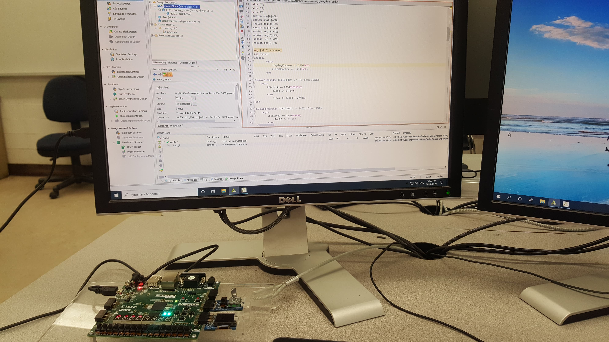
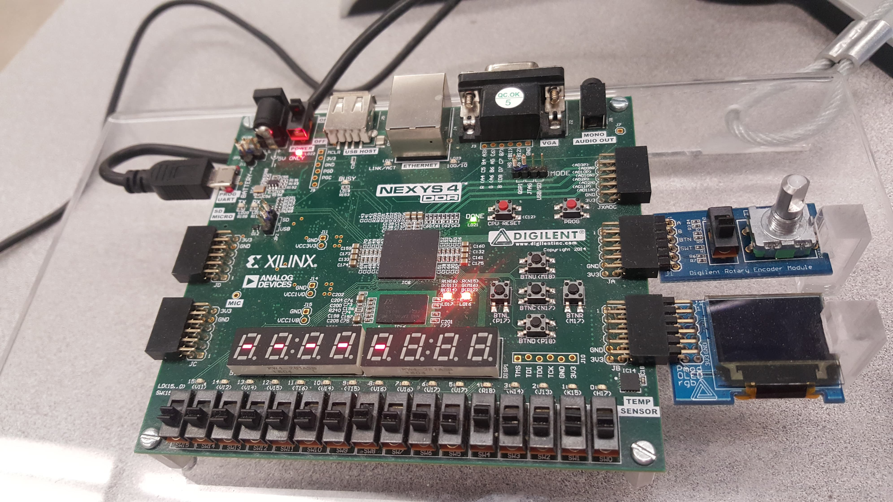

# FPGA-Alarm-Clock
This is an alarm clock that I created with my partner for my digital electronics course. The code was built on Vivado and executed on NEXYS4. 
You can find the video of this working at:
https://drive.google.com/drive/folders/1b0KQClNWkTlOVvG2EfKO36Noqkeg_LD7?usp=sharing

 
